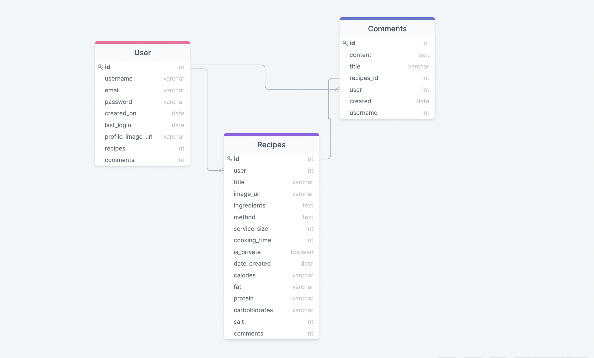
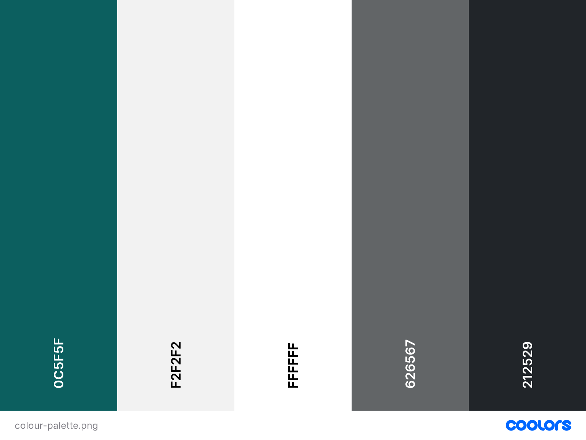

<h1 align="center">My Online Recipes</h1>

<h2 align="center">Code Institute - Milestone Project 3</h2>

My online recipes website help you to create, save and share your recipes with others. I love cooking, when I was nine years old, I started to write recipes in my school notebook, all the recipes from my beautiful Grandma that in piece rest, I stored them there, as well as others recipes that I encounter on my cooing journey. by the time I was 20 years old, I had realised that I had over 15 school notebooks and accessing all those recipes was a nightmare, flipping pages trying to find these recipes, so now thanks to code Institute I have created this beautiful recipes website that allow me not just save all my recipes but also share it with the world. I do not have to struggle to carry my notebooks anymore when I am travelling because it is all online. I also do not have to struggle to find a recipe that I have saved, as I just need to type the words from the title or the ingredients. and the website will give me all the relevant recipes I have and other recipes other people have shared as well. Also, the beauty of this is that anyone can come to this website and save their recipes free of charge. Furthermore there is a comment section at the bottom of each recipe so people can leave their opinion of what they like and what they do not like about that specific recipe.

The project was developed using **HTML5**, **CSS3**, **JavaScript**, **Python**, **Bootstrap**, **Flask**, and utilises a relational database -> **PostgresSQL**.

[Click here to visit the site.](https://myonlinerecipes.herokuapp.com/)

## Table of contents
- [Project Goals](#project-goals)
1. [**User (UX)**](#User-experience)
     1. [Strategy](#strategy)
     2. [Scope Plane](#Scope-Plane)
     3. [Structure](#structure)
     4. [Skeleton](#skeleton)
     5. [Surface](#surface)
2. [Features](#features)
     1. [Existing Features](#existing-features)
     2. [Future Feature Considerations](#future-feature-considerations)
3. [**Technologies Used**](#technologies-used)
4. [**Testing**](#testing)
    1. [Performance](#performance)
    2. [HTML Validation](#html-validation)
    3. [CSS Validation](#css-validation)
    4. [Manual Testing](#manual-testing)
    5. [Responsiveness](#responsiveness)
    6. [Tested User Stories](#tested-user-stories)
    7. [Bugs](#bugs)
5. [**Deployment**](#deployment)
    1. [How this Project was Deployed](#how-this-project-was-deployed)
    2.  [How to Run this Project in your Browser](#how-to-run-this-project-in-your-browser)
    3. [Cloning the Repository](#Cloning-the-Repository)
    4. [Manually Downloading the Repository](#Manually-Downloading-the-Repository)
    5. [ Opening the Repository](#Opening-the-Repository)
6. [**Credits**](#credits)
    1. [Content](#content)
    2. [Media](#media)
    3. [Code](#code)
7. [Acknowledgements](#acknowledgements)
8. [Disclaimer](#disclaimer)

    

### Project Goals
The goals of this project are to:
- To create a site where users can easily access recipes, create, save, edit, delete and share their own if they decide to.
-	Make MyOnlineRecipes website to be a reputable website by creating a professional and intuitive interface.
-	Create a website that is visually appealing and fully responsive on all devices and screen sizes.
- To display information in user-friendly way, contributing to an overall good user experience.
-	Present information about MyOnlineRecipes site so that visitors immediately comprehend what service it provides to its members. 
-	Allow visitors to easily contact the website administrator with any questions.
-	Encourage new members to sign up to the site.
-	Create an interactive website where a community can leave comments on the recipe as long as they have an account and logged in.
-	Store the users’ data so that it is can be accessed when required.
---
##  User Experience

### Strategy

- The User centred Design process started with the creation of the User Stories. these influenced subsequent feature, layout, and design decisions.

#### User Stories

#### Prospective User

As a potential MyOnlineRecipes site user I want to be able to: 

- Immediately comprehend the purpose behind the MyOnlineRecipes site and view some of the recipes.
- Navigate throughout the site with eases.
- Easily create an account and sign in to it.
- Log out of my account once finished on the website.
- Experience good responsive design, so I can access the site on different devices.
- Change my password in case somebody else has access to it.
- Contact the admin.
- See a variety of recipes for different meals of the day
- Enjoy stylish, clean design and style that is inline with the subject of the site

#### As a returning or registered user

As a registered user of MyOnlineRecipes site I want to be able to:

- Log into my account.
- Save private recipes that only I can see.
- Have the option to share my recipes with other users
- Create my own recipes.
- Edit the recipes I have added.
- Delete the recipes I have added.
- Have a rich text editor which enable me to writing beatiful content.
- Contact admin with queries or feedback.
- Comments on recipes, so I can share my opinion with other users.
- Find social media links, so I can follow them on different platforms.

#### Site Owner
As the owner of MyOnlineRecipes website I would like to:

-	Provide site members with an effective and user-friendly platform where they can read comments written by other members so that they make more informed choices when choosing a recipes to make.
- Provide site members with the option to share their recipes the others users.
- Present the commets in a visually appealing format.
- Provide site members with the ability to search the site for a specific recipes by entering the title or Ingridients into a search box within the site.
- Provide users with the ability to add general infomation about the recipes if the decide to, these include the recipes author’s name, title, Images, Ingredients, method or step by step process to make the recipes, service size, cooking time, date created, calories, fat, protein, carbohidrates, and salt. most of of the this field will be optional.
- Provide the user with a beatiful image cover in case they decide not put add an image to the recipes.
- Provide prospective members with the ability to sign-up easily
-	Provide visible contact details so that all site visitors can contact the site administrator with ease

###  Scope Plane

### **Existing Features**

The key features of the website were developed based on user needs. 

Users should be able to do the following on the website:

-	Easy navigation by using navigation bar. Nav links are clearly idenfied both on desktop and when sidenav is expanded on smaller devices.
- Responsive design allowing users to use site across all devices.
- Site layout is responsive to all media sizes.
- Users of the site can create an account.
- Users can login into their existing account.
-	Users can write a recipe comment as long as they are registered.
- Users can contact the site owner through a contact form
- Recipes can be created, read, updated and deleted (CRUD) by the users.
- On the create recipe form, there is a rich text editor which enable users to write beatiful content
- Users of the site, either logged in or not, can search the recipes either by text input or filtering the ingredients they want the recipe to have.
- Logged in users have the options to either share their recipes or keep it private by toggle the button (Share ?).
- Logged in users have access to their profile, and view all the the recipes they have created and also view the recipes that other
 people have decided to share.
- Recipe information includes the same as describe in the Site Owner e.g: recipes author’s name, title, Images, Ingredients, method or step by step process to make the recipes, service size, cooking time, date created, calories, fat, protein, carbohidrates, and salt.
- Flash messages appear when users create, edit, delete or update the recipe.
- Easily access the site’s social media channels.
- navigate through pagination on the recipe pages.
- Change their password securily by email.

### Structure

### Informational Architecture

After identifying the needs of the site's users and after visiting other recipes site and recommendation websites the following website design and features were chosen:

##### Header

The header of the page contains the **NavBar**, the  **Logo**, the following links located to the left: **Home page**, **My Recipes**, **contact**, **Dropdown menu with the name of the user and a list of options to logout or change password**. To the right there is a  search box with a button to search for recipes. The header It is a static element, and is fixed to the top of the page at all times. When the site get 750px down (mobile) the header content change from inline to column.  When the user is not a member the only thing they can see is the Home, Contact, Login Sign Up.

##### Home 
The Home page display all non-private recipes of the site and it is very responsive when it comes to a different device, it is composed of 5 cards if its a large device like a monitor or computer, and if it is a tablet device it has 3 cards, mini table with 2 cards, mobile of 750px down the home page just display 1 card. each card contains. an image, title, recipe owner name, and a comment sign along with the number of comments that recipe has.

##### Contact page 
The contact page contains a header title, a sentence encouraging the user to email the administrator, 3 texts input and a big texterea. also in the right corner, the is a button with the value of submit.

##### My Recipes page 
The My Recipes page which is only available for registered users, contains almost the same layout as the home page, except that on every card there are two buttons one for edit and another one for delete. at top of the page below, the header title,  there is a button with a plus sign where the user can click and add their recipes.

##### Login page 
The Loging page contains a card with a header title, two fields: one for the password and another one for the username, and a button below with a login text, below the button there is a sentence with the link of sign up and another one with the link to reset the password in case they have forgotten. each input field has a beautiful icon: one is a user icon and the other one is a key icon.

##### Sign up page 
The signup page contains the same as the login page exept that it contains 2 more input fields, which are the email and the comfirmation of the second password, also it has a sentence with a login link,  in case the user already has the credentioal to login. 

##### 404 page
Once the user navigates to a wrong path inside myonlinerecipes site, it will be redirected to a beautiful image which contains a button to return home, the header of the image saying 404 and a sentence letting the user know that he went to a run URL.

##### footer
The footer is statically positioned at the bottom of the page. Similar to the header, contrary to the header the footer's content stay in line when the content exceeds the viewport of the device. The footer contains a link to the project’s GitHub repository, the facebook  link of the site as well as the instagram link, and  also a link to my personal linkedIn profile.

### Skeleton

The UI wireframing tool, [Balsamiq](https://balsamiq.com/), was used to create wireframes for each page of the game as it would appear on desktop, tablet, and mobile devices.

The main content areas were expressed in similar ways to create consistency across the site. A home page featuring the name of the game and a start bottom, a main screen with all cards identical. Top left-hand corner features a flag poll that counts down, top right of the screen shows the game points, a contact page, and a footer, which contains very important information: copy right, LinkedIn link, GitHub link, all of these were included at the bottom of every page to help users navigate through the game efficiently.

 

#### Wireframes

##### Desktop

- [Home Page wireframe: ](./myonlinerecipes/static/documentation/wireframes/Home-desktop.png)

- [Contact Page wireframe: ](./myonlinerecipes/static/documentation/wireframes/contactpage-desktop.png)

- [Login page wireframe: ](./myonlinerecipes/static/documentation/wireframes/loginpage-destop.png)

- [Add Recipes form wireframe: ](./myonlinerecipes/static/documentation/wireframes/Addrecipeform-desktop.png)

- [My Recipes page wireframe: ](./myonlinerecipes/static/documentation/wireframes/myrecipespage-desktop.png)

- [Register account page wireframe: ](./myonlinerecipes/static/documentation/wireframes/Registeraccountpage-desktop.png)

##### Tablet
- [Home Page wireframe: ](./myonlinerecipes/static/documentation/wireframes/Home-tablet.png)
- [Contact Page wireframe: ](./myonlinerecipes/static/documentation/wireframes/contactpage-tablet.png)
- [Login page wireframe: ](./myonlinerecipes/static/documentation/wireframes/loginpage-tablet.png)
- [Add Recipes form wireframe: ](./myonlinerecipes/static/documentation/wireframes/Addrecipeform-tablet.png)
- [My Recipes page wireframe: ](./myonlinerecipes/static/documentation/wireframes/myrecipespage-tablet.png)
- [Register account page wireframe: ](./myonlinerecipes/static/documentation/wireframes/Registeraccountpage-tablet.png)

##### Mobile
- [Home Page wireframe: ](./myonlinerecipes/static/documentation/wireframes/Home-mobile.png)
- [Contact Page wireframe: ](./myonlinerecipes/static/documentation/wireframes/contactpage-mobile.png)
- [Login page wireframe: ](./myonlinerecipes/static/documentation/wireframes/loginpage-mobile.png)
- [Add Recipes form wireframe: ](./myonlinerecipes/static/documentation/wireframes/Addrecipeform-mobile.png)
- [My Recipes page wireframe: ](./myonlinerecipes/static/documentation/wireframes/myrecipespage-mobile.png)
- [Register account page wireframe: ](./myonlinerecipes/static/documentation/wireframes/Registeraccountpage-mobile.png)

 

### Database

**MyOnlineRecipes** utilises a relational Database via PostgreSQL for storing **User**, **Recipes** and **Comments** data.

- The **User** model is composed of 7 columns: username, email, password, date created, the last login of the user and an image of the user. The only field that are quired are title, Ingridients and method and they all have a * at the top. The User model has one to many relationships with the **Recipes** model and **Comments** model which help to access that data and filter it by the user id. by setting one to many relationships we were able to have multiple recipes and comments that belong to just one user.

- The **Recipes** model is composed of 15 columns, the main id which is set to Primary Key. Furthermore is connected by its id to the **Comments** model. The **Recipes** model has a one to many relationships with the **Comments** which means that a recipe can have many comments.

- The **Comments** model is composed of 7 columns including the id as well. this model does not have one to many relationships with other models but it can easily access to the **User** and **Recipes** model because of its **backref relationship** that points from **User** and **Recipes** to **Comments**

- Database schema design was created using [DrawSql](https://drawsql.app/), see below.

### Surface

##### Design
The Project Design is a combination of my own design implemented with the bootstrap framework. The colour helps the website to stand out and give a clear meaning of what the website is about as the colour is usually found in food and nature. Its aim is to be engaging, alluring, and cohesive.

##### Logo design 
The logo of the site is located on the left side of the navbar as the bootstrap standard logo, and it is bigger than the others links in order to stand out. and make it recognised by the users.

##### Colour Scheme
The colour scheme for the game was chosen in order to convey excitement, clean and visually appealing site.

 

*Colour palette created at* [coolors.co](https://coolors.co/ffbe0b-fb5607-ff006e-8338ec-3a86ff).

- #004b49, Deep jungle green,Psychologically, when humans think of this color, Deep jungle green, they might associate it with being clean, glamorous, elegant, the home, and accessibility.
     - Used in the navbar and in the footer as it makes a beautiful combination.

- #f2f2f2, Culture color, which is a light grey represent neutrality and balance. 
   - Used in the background of the website in order to the main content stand out.

- #ffffff, White represents purity or innocence and stands for everything good and right.
- Use in all the links of the text
- Used in the Card
- As main color text

- #626567, Granite Grey, used in the card for the text as it is darker than the Culture colour and makes the text to be more visible.

- #000000, Black color represents evil, darkness, night, and despair. It’s the color used to convey certainty and authority.
- Used in all header title so the users knows at glance where they are located

#### Icons
Icons were used within the site in order to help the user to understand the content easier. 
They were taken from [Font Awesome](https://fontawesome.com/) and chosen to be self explanatory.

#### Typography
After an intensive search for the right font, I encountered Montserrat, the most used font for recipes websites, this font I have used to be a company with Georgia and serif in case Montserrat does not load. I have used this font for the body of the website.

## Existing Features

The project consists of three main pages, and has a 404.html and 500.html error page, login and logout functionality, a response page page for for the contact, myrecipes that is where all the recipes for the user is stored, and the home page. The main pages can be accessed through the navbar.

**Fabicon**

Myonlinerecipes favicon, displayed on the web Brower’s tab, allows the user to identify the website by sight.
 
**More Features**

- **myonlinerecipe Logo**: It is the default logo style for boostrap but recognizable across all website.

- **The recipe form Page** and **The edif form Page**: allow the user to craete beatiful recipes, I added a rich ckeditor which help to tape the ingridients and method easier and more beatiful.

- **The Search functionality**: allow the user to search for any recipe in the database except for the recipe that are privat. they are allow to search by method, title and ingridients.

- **Commet section**: allow the user comment on any recipe and even ask questions about the recipe. All users can interact with each other this way and share their experiend with the recipe.

**Footer**
Each page has a fixed footer at the bottom. This provides Facebook, Instagram, Twitter and Tik Tok links as well as a copyright with my name on it.

#### (home)features
  - In home we can see the all the beatiful recipes, a big heading title so the user understand where it is located and a navbar and footer.
  - in Navbar we can vizualize the all links in color white and background green. all links contains icons to make the user understand at glance.
  - Footer contains copyright and links with the same color schema of the navbar.

#### game.html features
  - Title giving instruction.
  - Level 1 showing 8 cards,
  - level two with 16 cards, 
  - level three with 24 cards all identical with the Harry potter theme.
  - A footer with icons and links 
  - Top left-hand corner feature a flag poll that counts down to 30s.
  - Top right of the screen has a harry potter awl carrying mail that shows the game 
#### contact.html features
  - Title encoraging user to send a mesage.
  - A well structured contact form.
  - A Image representing a buttom that send the mesage
  - A footer with icons and links 
#### contact-response.html features
  - Has a positive message comfirming to the user that their message has been sent.
  - A botton that redirect the user back home if desired.
  - A footer with icons and links

#### contact-error-response.html features
  - Has a message informing the user that their message has not been sent.
  - A botton that redirect the user back to contact if desired to try again.
  - A footer with icons and links

  #### 404.html features
  - Has a message informing the user that the page they are loking for does not exist.
  - A botton that redirect the user back home if desired.
  - A footer with icons and links

### Future Feature Considerations
  - For adding future features I would like to implement a login and logout functionality and create a review system that allow users to imform me about improvement they would like to see in the game, I also would like to add more levels, I also would like to add a score board where player can compete to become top scorer.

## Technologies Used

* The project was written in HTML and CSS and JavaScript with litle use of bootstrap 5
* The project was written and tested in the [Gitpod](https://gitpod.io/) IDE.
* The project was debugged using [Google Chrome](https://www.google.com/intl/en_uk/chrome/) [Dev Tools](https://developers.google.com/web/tools/chrome-devtools).
* The project uses [GitHub](https://GitHub.com/) for hosting source code, for utilising git version control, and for hosting the site on GitHub pages.  
* The project's template was generated from [Code Institute's Gitpod Template](https://GitHub.com/Code-Institute-Org/gitpod-full-template).
* The project uses [FontAwesome](https://fontawesome.com/) v5.15.1, a free icon-set/toolkit for web development.
* The project uses [Google Fonts](https://fonts.google.com/) for typography.
* The project's images were compressed via [tinyjpg](https://tinyjpg.com/) to be appropriately sized for web content.
* The project's accessibility was assesed via WebAim's [W.A.V.E](https://wave.webaim.org/) and Google Chrome's [Lighthouse](https://developers.google.com/web/tools/lighthouse).
* The project's screen-reader accessibility was tested using [Screen Reader for Google Chrome](https://chrome.google.com/webstore/detail/screen-reader-for-google/nddfhonnmhcldcbmhbdldfpkbfpgjoeh/related?hl=en).
* The project used Toptal's [Colorfilter](https://www.toptal.com/designers/colorfilter/) to assess how colour-blind-friendly the site was.
* The project's colour contrast ratio was assessed using [Contract-Ratio](https://webaim.org/resources/contrastchecker/)
* The project's HTML was validated using [W3C HTML Markup Validator](https://validator.w3.org/).
* The project's CSS was validated using [W3C Jigsaw CSS Validator](https://jigsaw.w3.org/css-validator/).
* The project's wireframes were designed in [Balsamiq](https://balsamiq.com/wireframes/).
* [Slack](code-institute-room.slack.com). Used during all phases of development and testing to find the answers to questions and the solutions to problems enountered.
* [Code Pen](https://codepen.io/denic/pen/GRoOxbM). The code for the typing animation efect on index.html page was initially sourced from the codepen.io site.
* [Coolors](https://coolors.co/ffbe0b-fb5607-ff006e-8338ec-3a86ff). Used to choose a colour scheme.
* [flaticon](https://www.flaticon.com/search?word=python&type=icon). Also Used for progress bar icons in skills.html.
* [icons8.com](https://icons8.com/icons/set/html). Used for progress bar icons in skills.html.
* [chir.ag](https://chir.ag/projects/name-that-color/#07203A). Used for checking the real name of the colors implemented.
* [Favicon.io](https://favicon.io/favicon-converter/). used to convert the logo to favicon.
* [designs.ai](https://designs.ai/colors/color-meanings/midnight-blue). used to check colors combinations to achieve beautiful results.
* [cloudconverted.com](https://cloudconvert.com/png-to-webp). used to convert png images to webp for better performance.
* [Adobe illustrator.](https://www.adobe.com/uk/products/illustrator.html). used to draw all images.
* [dafont.com](https://www.dafont.com/). used to for the Farry Potter font.
* [freepik.com](https://www.freepik.com/free-vector/error-404-concept-illustration_7741849.htm#query=404&position=4&from_view=keyword). 404 error image was taken from here.
* [freesound.org](https://freesound.org/people/f4ngy/sounds/240776/). use for the game sounds.

## Testing

[Google Chrome Developer Tools](https://developers.google.com/web/tools/chrome-devtools) were used extensively throughout the development process in order to test whether elements were responsive when viewed on mobile and tablet devices. When problems were encountered the Device Selector was used to target the element.  Using the Elements Panel in Developer Tools the code in question was altered in order to achieve the desired result. 
Working code snippets were then replicated in the style.css file in [Gitpod](https://www.gitpod.io/). Other solutions for errors were found in the Code Institute [Slack](code-institute-room.slack.com) channels, on [Stack Overflow](https://stackoverflow.com/), on [W3Schools](https://www.w3schools.com) and on [Code Pen](https://codepen.io).

  ### Home Page

The website was regularly tested using the Google Chrome Developer Tools Lighthouse test. During the testing I highlighted three errors across the site which have since been recitified:

 Erro 1 - "Elements contain focusable descendents" [Image of the issue](assets/documentation/testing/home-error.png)

 Erro 2 - "Links do not have dicernible name" [Image of the issue](assets/documentation/testing/accesibility-errors.png)

Erro 3 - "Images are not properly size"

My game is made of mostly using images. Images are very dificult to get a good score with google chrome, I have try to increase the score by changing the images extension from png to webp or avif as google Chrome Lighthouse recommend to get better score however Safari does not support this file and for does not show the images.

**Solution Error 1** Added i tag with classes for icons in footer.

**Solution Error 2** Added aria-label and rel attribute.

**Solution Error 3** Properly size images.

#### Home

#### Game

 

### contact Page

### Contact response page

### Contact response error page

### 404 page

 

### HTML Validation

[W3C HTML Validation Service](https://validator.w3.org/#validate_by_uri) was used to validate the HTML documents. It highlighted four errors across the site which have since been recitified: 
- Misspell div element in home and contact page, the correct element was added.
- "Element bold not allowed as a child of element p". The element was eliminated and added a class called bold.
- "The aria-labelledby attribute must point to an element in the same document". I copied the code for the modal from bootstrap and as I was opening the modal with my own javascript, ther were no need for me to used aria-labelledby attribute, so I deleted the aria-labelledby.
- "Duplicate ID" Deleted the ids and added classes. 

The site currently has no errors:

### Home page 

### Game page 

### Contact page 

 

### CSS Validation

[W3C CSS Validation Service](https://jigsaw.w3.org/css-validator) was used to validate the style.css file.

There were no errors to show so I did not have to fix anything:

The style.css file currently has no errors:

 

### Manual Testing
The game has been tested in the following browsers:
- Chrome Version 85.0.4183.121 
- Samsung Internet Version 12.0.1.47	
- Microsoft Edge Version 85.0.564.63 
- Opera 70
- Mozilla Firefox 81.0.1

The game works and functions as expected on Samsung Internet, Google Chrome, Microsoft Edge, Opera and Firefox.
 

### Responsiveness
The game was tested for responsive design using [Google Chrome Developer Tools](https://developers.google.com/web/tools/chrome-devtools).  
It was tested, and found to respond appropriately with regard to each of the following:

**Mobile devices:**
- Moto G4
- Galaxy S5
- Pixel 2
- Pixel 2 XL
- iPhone 5/SE
- iPhone 6/7/8
- iPhone 6/7/8 Plus
- iPhone X

**Tablet devices:**
- iPad
- iPad Pro
- Surface Duo
- Galaxy Fold

**Laptop dimensions:**
- 15" Laptop (1024 x 800)
- 13" Laptop (1024 x 800)

**Desktop dimensions:**
- 24" Desktop (1920 x 1200)
- 22" Desktop (1680 x 1050)
- 20" Desktop (1600 x 900)

 
## Navigation bar (Navbar)

## Navigation in (footer)

All functionality for the footer was manualy tested on every page.

* Visit all links within the navbar in every possible order to ensure they are functional and route correctly.

* Play the game in every level to ensure the game works as espected.

## Enquire Form
*Ensure all placeholders has its appropriate name.
*Ensure Full Name field accepts any value, but requires at least one character to be deemed valid.
*Ensure Subject field accepts any value, but requires at least one character to be deemed valid.
*Ensure Message field accepts any value, but requires at least one character to be deemed valid.
*Ensure Email field only accept values in appropriate email format and cannot leave it in blank.
*Ensure all input request are met before submitting the form.
*Ensure users or potential employers received the nice and tidy message after submitting the form.

 
 

### Bugs

No bugs

 

## Deployment

## How this Project was Deployed

This project was deployed to GitHub pages via the following steps:

1. Log into [GitHub](https://GitHub.com/).
2. From the list of Repositories, select [Milestone-Project2 ](https://github.com/Gersondelacruzdeveloper/Milestone-Project2).
3. From the Repositories sub-headings, select "Settings".
4. Under "Options", the first category of settings, scroll down to the GitHub Pages section.
5. From the dropdown list under the "Source" heading, select "master".
6. A second drop-down menu that appears should remain as the default value, "/root".
7. Press Save. 
8. On Page refresh, scroll back down to the GitHub Pages section, and the link to the deployed site will be available in a green sub-section with a tick icon next to it.

As this project was developed on the master branch, all changes made to the repository are immediately reflected in the deployed project.

## How to Run this Project in your Browser

1. Install the [Google Chrome](https://www.google.co.uk/chrome/) or [Firefox](https://www.mozilla.org/en-GB/exp/firefox/new/) browser.
2. Install the applicable [GitPod](https://www.gitpod.io/docs/browser-extension/) Browser Extensions for your chosen browser.
4. Create a [GitHub](https://GitHub.com/join) account. 
3. Log in to [Gitpod](https://gitpod.io/login/) using your GitHub account.
4. From the list of Repositories select [Milestone-Project2 ](https://github.com/Gersondelacruzdeveloper/Milestone-Project2)
5. Open the repository in Gitpod:
    * Click the green "Gitpod" icon at the top of the Repository.
6. A new workspace will open with the current state of the master branch. Any changes made to the master branch after this point will not be automatically updated in your Gitpod Workspace.

### Cloning the Repository

1. Vsisit this link [Milestone-Project2 ](https://github.com/Gersondelacruzdeveloper/Milestone-Project2).
2. Click the "Code" dropdown box above the repository's file explorer. 
3. Under the "Clone" heading, click the "HTTPS" sub-heading.
4. Click the clipboard icon, or manually copy the text presented: `https://github.com/Gersondelacruzdeveloper/Milestone-Project2.git`
5. Open your preferred IDE (VSCode, Atom, PyCharm, etc).
6. Ensure your IDE has support for Git, or has the relevant Git extension.
7. Open the terminal, and create a directory where you would like the Repository to be stored.
8. Type `git clone` and paste the previously copied text (`https://github.com/Gersondelacruzdeveloper/Milestone-Project2.git`) and press enter.
9. The Repository will then be cloned to your selected directory. 

### Manually Downloading the Repository

1. Vsisit this link [GitHub Repository](https://GitHub.com/BAK2K3/hard-drivers).
2. Click the "Code" dropdown box above the repository's file explorer. 
3. Click the "Download ZIP" option; this will download a copy of the selected branch's repository as a zip file.
4. Locate the ZIP file downloaded to your computer, and extract the ZIP to a designated folder which you would like the repository to be stored.

### Opening the Repository 

1. Open your preferred IDE (VSCode, Atom, PyCharm, etc).
2. Navigate to the chosen directory where the Repository was Cloned/Extracted.
3. You will now have offline access to the contents of the project.

---

## Credits

### Content

* All text used throughout the site was written by me.
* All general development concepts were devised by me.

### Media

* All png images were sourced from [flaticon](https://www.flaticon.com/search?word=python&type=icon) and [icons8.com](https://icons8.com/icons/set/html)

* [flaticon](https://www.flaticon.com/search?word=python&type=icon). Used for most of the progress bar png image except from the last one in skills.html.
* [icons8.com](https://icons8.com/icons/set/html). Used for the last image in progress bar in skills.html. 

## Code

* HTML/CSS: Implementation and utilisation of Grid CSS layout was assisted by [CSS-Tricks](https://css-tricks.com/snippets/css/complete-guide-grid/).
]
* HTML/CSS: Implementation and utilisation of Grid CSS layout was assisted by [W3school](https://www.w3schools.com/css/css_grid.asp).

* HTML/CSS: code for fliping the card found here and modified acording to my requierments [W3school](https://www.w3schools.com/howto/howto_css_flip_card.asp).

* HTML/CSS: code for spinners W3school](https://www.w3schools.com/howto/tryit.asp?filename=tryhow_css_loader2).

---

## Acknowledgements

- [Code Institue](https://codeinstitute.net/) and the very helpful tutors.
- My project mentor [Gurjot Singh](https://www.linkedin.com/in/gurjot-singh-64466b199/) for his help and guidance during the design and build process. 
- The [Code Institue](https://codeinstitute.net/) community on [Slack](code-institute-room.slack.com) for their support.

 

# Disclaimer

This Portfolio is for educational purposes only.

---